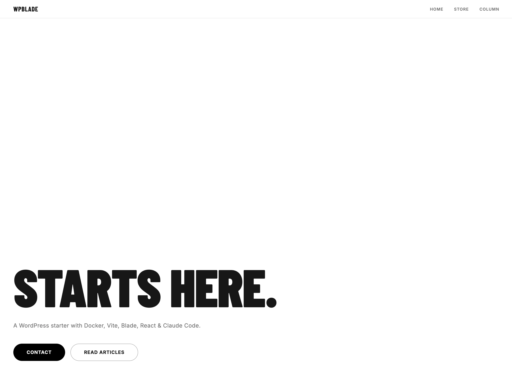

# WPBlade

**A modern WordPress theme starter built for maintainability — powered by BladeOne, Vite, and Claude Code.**


[日本語版はこちら](README.ja.md)



---

## The problem

WordPress development usually ends in one place: an unmaintainable `functions.php`. No separation of concerns. Templates full of raw PHP. Business logic entangled with hook registration. The longer the project runs, the worse it gets.

WPBlade solves this without abandoning WordPress. It applies modern software design — PSR-4 namespaces, a Service layer, a templating engine — while staying inside the WordPress template hierarchy. No custom framework. No fighting the platform.

### Who is this for?

| If you want to… | WPBlade gives you… |
| --- | --- |
| Use Blade templates in WordPress | BladeOne integrated with `Blade::render()` — same `@extends`, `@section`, `@include` as Laravel |
| Escape `functions.php` chaos | Hook registration in `includes/functions/`, domain logic in `app/` with PSR-4 |
| Build WordPress sites with Claude Code | `.claude/rules/` scoped by file type — AI generates code that follows your architecture |
| Keep performance-first | React loaded only on pages that need it; Vanilla JS everywhere else |
| Ship securely | Escaping at the Service layer, CRLF-safe email headers, nonce enforcement built in |

### Design Philosophy

**WordPress template hierarchy as routing**
WordPress already has routing: `front-page.php`, `single-{post_type}.php`, `archive-{post_type}.php`. Each template file is treated as a thin controller — fetch data, call `Blade::render()`, done. One file = one route = one controller. No extra routing layer needed.

**PSR-4 over `functions.php`**
Hook registration lives in `includes/functions/` (one file per concern). Domain logic lives in `app/WpBlade\`. `functions.php` contains only `require_once` calls. WordPress wiring and business logic never share the same file.

**BladeOne for templates**
`<?php if ?>` and `<?php foreach ?>` in HTML are hard to read and easy to get wrong. Blade's `@extends`, `@section`, and `@include` provide Laravel's template inheritance — without pulling in the full framework.

**React only where it's needed**
React loads only on pages that require interactive state (`is_page(['contact'])`). All other pages use the Vanilla JS bundle. No React runtime shipped to pages that never use it.

**3-layer resource structure**
`views/`, `scss/`, `js/`, `ts/`, and `images/` all follow the same `base / components / pages` hierarchy. Same mental model everywhere: infrastructure, reusable component, or page-specific?

**Security as a default**
Output escaping (`esc_html`, `esc_attr`, `esc_url`) is done at the Service layer before data reaches Blade — so it can't be forgotten in templates. CRLF is stripped from email headers explicitly, not delegated to downstream libraries. REST API nonce verification is enforced at `permission_callback`.

**Claude Code rules built in**
`.claude/rules/` contains coding conventions scoped by file type. Edit a `.blade.php` file and only Blade conventions load. Edit a `.tsx` file and only TypeScript/React rules load. AI-generated code follows the same architecture and security standards as manually written code.

### Tech Stack

| Category | Tool |
| --- | --- |
| Template Engine | [BladeOne](https://github.com/EFTEC/BladeOne) 4.x |
| Frontend Build | [Vite](https://vitejs.dev/) 6 |
| CSS Preprocessor | Sass (SCSS) |
| React (selected pages) | React 19 + TypeScript + React Hook Form + Zod |
| Animation | [GSAP](https://gsap.com/) 3 / [Splide](https://splidejs.com/) 4 |
| PHP Validation | [Respect\Validation](https://respect-validation.readthedocs.io/) |
| Code Formatter | [Prettier](https://prettier.io/) 3.x |
| PHP | 8.2+ |
| Node.js | v22 (pinned via `.nvmrc`) |
| Database | MySQL 8.0 |
| Local Environment | Docker (WordPress + MySQL + phpMyAdmin + Mailpit) |

### Prerequisites

- [Docker Desktop](https://www.docker.com/products/docker-desktop/) installed
- [Node.js v22](https://nodejs.org/) installed (`nvm use` recommended)
- [Composer](https://getcomposer.org/) installed

### Quick Start

```bash
# 1. Clone and enter
git clone https://github.com/RyotaNakata/wpblade.git && cd wpblade

# 2. Configure environment
cp .env.example .env
```

The defaults work out of the box. Edit if you need different ports or credentials:

```env
MYSQL_ROOT_PASSWORD=rootpass
MYSQL_USER=wp
MYSQL_PASSWORD=wppass
MYSQL_DATABASE=wordpress

WP_PORT=8080
PMA_PORT=8081
```

```bash
# 3. Start Docker
docker-compose up -d

# 4. Install theme dependencies
cd wp-content/themes/wpblade && composer install && npm install

# 5. Start the dev server
npm run dev
```

Then open `http://localhost:8080`, complete the WordPress installation, and activate the **WPBlade** theme under **Appearance → Themes**.

### Local URLs

| Service | URL |
| --- | --- |
| WordPress | http://localhost:8080 |
| phpMyAdmin | http://localhost:8081 |
| Vite dev server | http://localhost:5173 |
| Mailpit (mail UI) | http://localhost:8025 |

### Commands

```bash
npm run dev           # Start dev server with HMR
npm run build         # Production build
npm run format        # Format JS / SCSS / Blade / PHP
npm run format:check  # Check formatting without writing files
```

### Directory Structure

```
.
├── docker-compose.yml
├── .env.example
└── wp-content/themes/wpblade/
    ├── functions.php               # Entry point (require_once only)
    ├── front-page.php              # Top page      ┐
    ├── page-store.php              # Store page    │ Thin controllers:
    ├── page-contact.php            # Contact page  │ fetch data + Blade::render()
    ├── archive-column.php          # Column list   │
    ├── single-column.php           # Column detail ┘
    ├── 404.php
    │
    ├── app/                        # PSR-4 (WpBlade\)
    │   ├── View/Blade.php          # BladeOne wrapper
    │   ├── View/ViteAssets.php     # Vite asset resolution
    │   ├── Http/Controllers/       # REST API endpoints
    │   ├── Services/               # Domain logic
    │   ├── Constants/              # Constants (final class)
    │   └── Helpers/
    │
    ├── includes/functions/         # Hook registration only
    │   ├── theme-support.php
    │   ├── post-types.php
    │   ├── assets.php              # Vanilla JS ↔ React switch via is_page()
    │   ├── contact.php
    │   └── mail.php
    │
    └── resources/                  # All source files follow base/components/pages
        ├── views/                  # Blade templates
        ├── scss/                   # Sass
        ├── js/                     # Vanilla JS
        ├── ts/                     # React + TypeScript
        └── images/
```

### Architecture

#### Page rendering

```
front-page.php  (thin controller)
  → Blade::render('pages.top.index', compact(...))
    → resources/views/pages/top/index.blade.php
      → @extends('layout')
        → @include('components.header') / @include('components.footer')
```

#### React page (contact form)

```
page-contact.php
  → Blade::render('pages.contact.index')   ← outputs <div data-element="contact-form">
  → ViteAssets::enqueueReact()             ← window.wpblade = { restUrl, nonce }
  → contactPage() → createRoot(el).render(<ContactForm />)
```

#### Contact form submission

```
ContactForm (React)
  → POST /wp-json/wpblade/v1/contact  [X-WP-Nonce header]
    → ContactController::checkPermission  [wp_verify_nonce]
    → ContactController::handle
      → ContactService::submit
          → Honeypot check (silent success if flagged)
          → Respect\Validation
          → MailService::sendNotification  (admin + store)
          → MailService::sendAutoReply     (sender confirmation)
```

#### dev / prod mode

`npm run dev` writes a `public/hot` file. `ViteAssets` checks for its existence.

| Mode | Condition | Behavior |
| --- | --- | --- |
| dev | `public/hot` exists | HMR via `<script type="module">` |
| prod | `public/hot` absent | Hashed files from `manifest.json` via `wp_enqueue_*` |

#### Application layer responsibilities

| Layer | Location | Responsibility |
| --- | --- | --- |
| View | `app/View/` | Blade wrapper, ViteAssets |
| Controller | `app/Http/Controllers/` | REST API endpoints |
| Service | `app/Services/` | Domain logic (WordPress-agnostic in principle) |
| Constants | `app/Constants/` | Constants (`final class`) |
| Helpers | `app/Helpers/` | Global helper functions |

### Development with Claude Code

This starter is optimized for [Claude Code](https://claude.ai/code). The `.claude/` directory contains everything needed to make AI-assisted development consistent with the project's architecture.

#### How it works

`.claude/rules/` contains one rule file per concern. Rules are scoped to file types so only relevant conventions load when Claude is working on a specific file:

| Rule file | Loads when editing |
| --- | --- |
| `architecture.md` | Always |
| `security.md` | Always |
| `backend/php.md` | `app/`, `includes/`, `*.php` |
| `frontend/blade.md` | `*.blade.php` |
| `frontend/scss.md` | `*.scss` |
| `frontend/typescript.md` | `resources/ts/` |
| `frontend/javascript.md` | `resources/js/` |
| `frontend/accessibility.md` | blade / js / ts / scss |
| `frontend/vite.md` | vite config, js, ts, scss |
| `frontend/image.md` | `resources/images/`, blade, scss |

This means Claude generates code that respects the thin-controller pattern, escapes output at the Service layer, follows the BEM-derived naming convention, and enforces nonce verification — without being reminded each time.

#### Spec-driven development flow

```
.claude/specs/YYYYMMDD-feature-name/
├── requirement.md   # Purpose, scope, done criteria
├── design.md        # Architecture and implementation approach
└── tasks.md         # Phase-by-phase task list
```

1. Describe the feature to Claude Code
2. Fill in `requirement.md` through dialogue
3. Lock in the approach in `design.md`
4. Execute `tasks.md` top to bottom

Works without Claude Code too — the rule files serve as standalone coding convention docs for any developer joining the project.

### Mail

All emails are captured by Mailpit in development when `WPBLADE_ENV` is not `production`.

| Variable | Purpose |
| --- | --- |
| `WPBLADE_ENV` | Real delivery only when `production` |
| `WPBLADE_SMTP_HOST` | SMTP host (default: `mailpit`) |
| `WPBLADE_SMTP_PORT` | SMTP port (default: `1025`) |

### Custom Post Types

| Slug | Description |
| --- | --- |
| `column` | Column articles (archive + REST API enabled) |

### License

MIT
